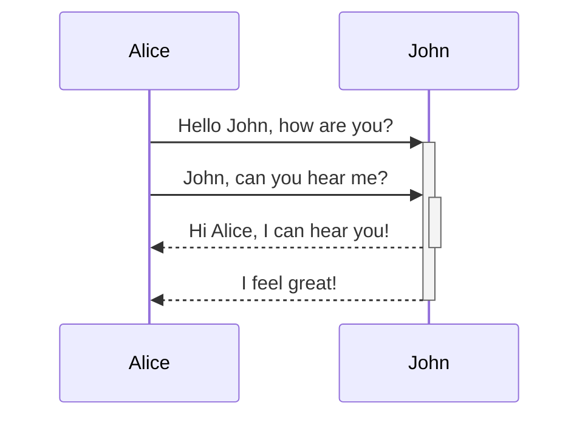
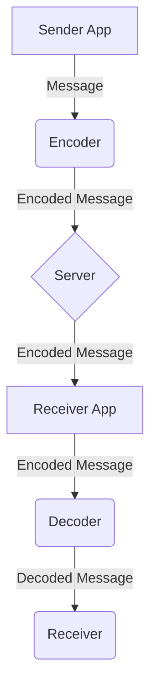

# In4chan

## End-to-End Encrypted chat application

## System Design

In this project I used ***Firebase*** as the server and for frontend, I used android xml. 

* It has a persistent server which means even if you lose network, whenever the internet connection is live again it will receive and send message automatically.
* Chats are stored on the local database using ***Android*** and ***SQLite***.

* Server only holds the message as long as the receiver is offline. 
 
* Messages sent to server are encrypted on the client device first and then decoded on the receiver device. 

## System GUI

The app is easy-to-use and user-friendly. Everything is labeled and easy to access.

* **Log in** and **Sign up**. 
  
* **Profile List** and **Chat List**. 
  
* **Sending Message** and **Clearing Chat** UI flow. 
   
* **Menu** for Browsing Profile and Chat List. 
  

